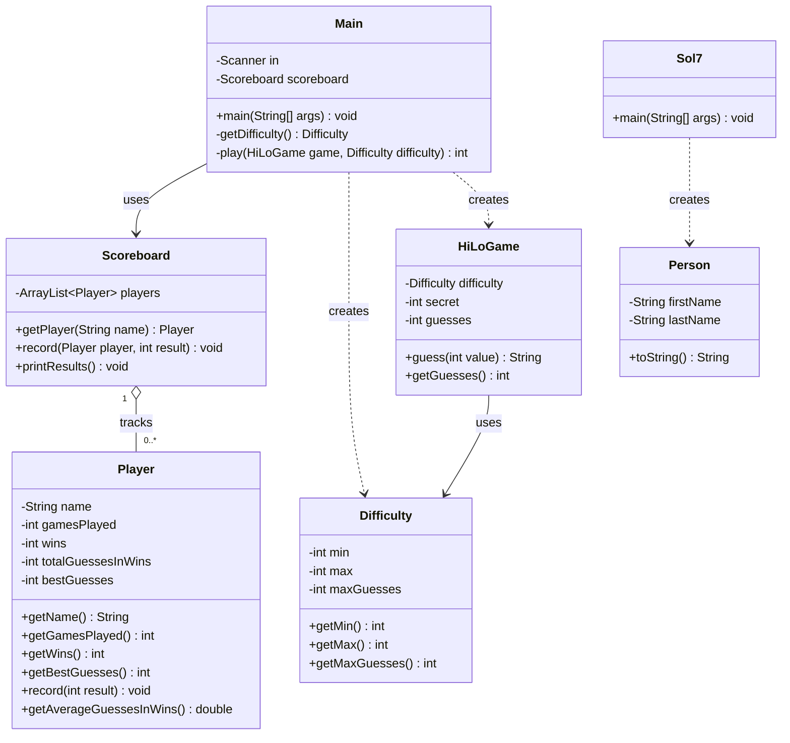

# Class diagram

```mermaid
classDiagram
    class Main {
        -Scanner in
        -Scoreboard scoreboard
        +main(String[] args) void
        -getDifficulty() Difficulty
        -play(HiLoGame game, Difficulty difficulty) int
    }

    class Scoreboard {
        -ArrayList~Player~ players
        +getPlayer(String name) Player
        +record(Player player, int result) void
        +printResults() void
    }

    class Player {
        -String name
        -int gamesPlayed
        -int wins
        -int totalGuessesInWins
        -int bestGuesses
        +getName() String
        +getGamesPlayed() int
        +getWins() int
        +getBestGuesses() int
        +record(int result) void
        +getAverageGuessesInWins() double
    }

    class HiLoGame {
        -Difficulty difficulty
        -int secret
        -int guesses
        +guess(int value) String
        +getGuesses() int
    }

    class Difficulty {
        -int min
        -int max
        -int maxGuesses
        +getMin() int
        +getMax() int
        +getMaxGuesses() int
    }

    class Sol7 {
        +main(String[] args) void
    }

    class Person {
        -String firstName
        -String lastName
        +toString() String
    }

    Main --> Scoreboard : uses
    Main ..> Difficulty : creates
    Main ..> HiLoGame : creates
    Scoreboard "1" o-- "0..*" Player : tracks
    HiLoGame --> Difficulty : uses
    Sol7 ..> Person : creates
```
